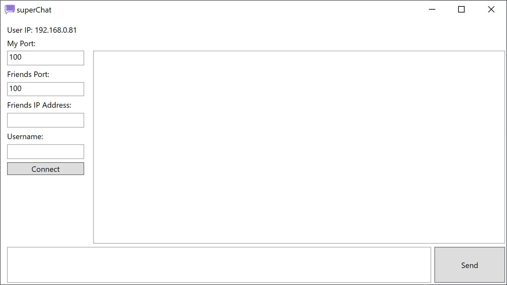

# superChat
This application is a simple P2P (peer-to-peer) LAN communication application. This application allows clients to connect to a certain IP and send and receive messages through a small, compact and non-intrusive chat application requiring no external libraries to function.

## How To Use
1. Enter the port you wish to communicate from on your side
2. Enter the port your friend wishes to communicate from on their side
3. Enter your friends IP address
4. Enter yourself a username
5. Press connect
6. Have fun and chat away!

## Prerequisites
This program requires no prerequisites

## Built With
This program was built with no external frameworks excluding the C# system libraries

## Authors
* **Shaan Khan** - *All Work*

## License
This project is licensed under the Mozilla Public License 2.0 - see the [LICENSE](https://github.com/ShaanCoding/superChat/blob/master/LICENSE) files for details
